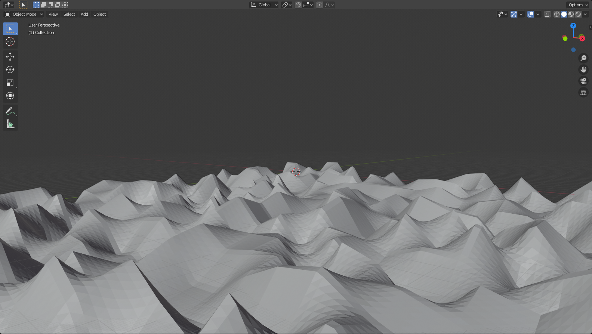

# PerlinMap
A simple wasm perlin map creator

To build and create a randomly generated perlin noise landscape map
just run the command:

Linux:

    gcc perlin/main.c perlin/PerlinMapCreator.c perlin/Utils.c perlin/SimpleHashBuffer.c -Wall -o program -O9

Windows:

    buildC.bat

After the build is done, just run the 'program' executable and in 'grid.obj' map will be created.

